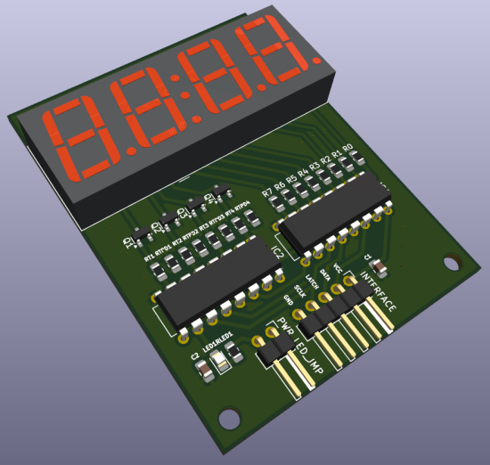

# Overview

**Drv7Seg2x595** is a single-class Arduino library for driving a multiplexed 7-segment display using
two daisy-chained 74HC595 shift register ICs.

## Concept

7-segment displays are simple, cheap and reliable data output devices. However, interfacing them with
a microcontroller (MC) requires an appropriate software and, most commonly, an additional hardware.

Typically, 7-segment displays come in models with 1 to 4 character positions (digits). Number of input pins for
any given model equals 8 + number of positions, thus 9 is the minimum and 12 is the maximum (duplicated pins count
as one). Driving such a display requires a number of individual signals equal to the number of the input pins:
* 8 signals to turn ON and OFF individual segments (including a dot segment, also known as a decimal point or DP).
* 1 to 4 signals to turn ON and OFF whole positions.

Due to significant number of required signals, output-extending devices, such as output shift registers, are commonly
used. **74HC595**, sometimes simply called **595**, is a widely used 8-bit serial-in, parallel-out (SIPO) shift register
integrated circuit (IC) commonly employed to drive 7-segment displays. Despite being a SIPO register primarily, it also
features an auxiliary serial output that allows for **daisy-chaining**: connecting multiple 595s in such a way that
the serial output of the previous IC goes to the serial input of the next one and all ICs in the chain share the same
**clock** and **latch** signals. Two daisy-chained 595s form a 16-bit shift register, which is sufficient for
controlling any typical 7-segment display.

The API provided by this library allows for control over 1 to 4 character positions. The number of positions to be
used must be specified during the driver configuration.

## Control bytes

This library assumes that the 16-bit register consists of two bytes with distinct roles:
* **segment byte** (**`seg_byte`**) controls individual display segments to form recognizable symbols (glyphs).
* **position byte** (**`pos_byte`**) controls whole character positions and thus determines where the next segment
pattern (defined by `seg_byte`) will be output. 1 to 4 bits out of 8 are used, the rest are not connected (NC).

The API provided by this library allows for any order of `seg_byte` and `pos_byte` placement within the register,
that is, any of these bytes may be either upper or lower byte. The byte order must be specified during the driver
configuration.

## Multiplexing

This library relies on **multiplexing**: a way of driving a multi-digit 7-segment display by turning on only one
character position at a time in quick succession, in a cycle. Because the multiplexing cycle runs faster than
the eye can follow, all positions appear to be lit continuously, even though only one is actually turned on at
any given moment.

This approach greatly simplifies the circuit because it doesn't rely on a separate set of segment-control outputs
for every position and instead utilizes the single set of segment-control outputs shared by **all** positions
(the defined segment pattern shows up only on the intended position anyway, because only that position will be
turned on at the appropriate moment).

### Ghosting and countermeasures

Advantages of multiplexing come with an unwanted side effect called **ghosting**: segments can seem to have a faint,
"ghost-like" glow on positions that are supposed to be off. To avoid this effect, the library utilizes the anti-ghosting
techniques that involve retention of a currently output glyph on a respective position for a short period of time.
Duration of the said period can be fine-tuned by the library user via the library's API.

The library's anti-ghosting logic is based on a non-blocking, `micros()`-based timer. No blocking, `delay()`-based
timers are used.

## Position switching

Every character position is turned on (powered) by either setting or clearing the `pos_byte` bit specified during
the driver configuration. It can be done because the bit value determines the digital output level (either high or low)
of the corresponding parallel output pin, which makes it possible to source/sink current from/to that pin.
The resulting current may be used to power the position directly or via a switching device, such as a transistor.
The latter approach is far more common, since 595's capacity for sourcing/sinking current for a whole set of 8 LEDs gets
close to or exceeds its electrical limitations.

Depending on the display type (whether it's a common-cathode or a common-anode device) and the switching device type
(whether it's an active-high device, like an NPN BJT or an N-channel MOSFET, or an active-low device, like a PNP BJT or
a P-channel MOSFET), positions will be turned on either by high or low digital output level. The API provided by this
library supports both variants. The switching type (active-high or active-low) must be specified during the driver
configuration.

## Reference wiring

Here's a typical circuit diagram for the described arrangement (assumes a common-cathode display):

.png)

For convenience, the example sketch default constant values corresponds to the circuit diagram provided here.

Wiring for a common-anode display is almost identical, the only difference being that the transistors' emitters
should connect to the display's common pins and their collectors should connect to the circuit's positive rail (VCC).

The wiring in your circuit **may** differ from the provided schematic to some degree, and the library will still be
applicable as long as your circuit complies with the premise of the `seg_byte` and `pos_byte` distinct roles.

## API usage

Include the library:
```cpp
#include <Drv7Seg2x595.h>    // Arduino style.
//#include "Drv7Seg2x595.h"  // Generic embedded programming style.
```

### Driver configuration

Choose **one** of the following variants.

Bit-banging:
```cpp
// Prototype.
int32_t begin_bb(ByteOrder byte_order,           // Whether seg_byte or pos_byte will be an upper byte.
                 PosSwitchType pos_switch_type,  // Whether high or low output level turns on a character position.
                 uint32_t data_pin,              // The pin that outputs the next bit value to be shifted.
                 uint32_t latch_pin,             // The pin that propagates the shifted data to the output register.
                 uint32_t clock_pin,             // The pin that commands the next bit value to be shifted.
                 PosBit pos_1_bit,               // Number of the pos_byte bit that will control the 1st position.
                 PosBit pos_2_bit,               // Number of the pos_byte bit that will control the 2nd position.
                 PosBit pos_3_bit,               // Number of the pos_byte bit that will control the 3rd position.
                 PosBit pos_4_bit,               // Number of the pos_byte bit that will control the 4th position.
                );

// Example call.
Drv7Seg.begin_bb(Drv7SegPosByteFirst,  // Other option is Drv7SegSegByteFirst.
                 Drv7SegActiveHigh,    // Other option is Drv7SegActiveLow.

                 /* Digital output pins you want to use for driving the display.
                  * Pin numbers must correspond to the pin numbering specified
                  * by the Arduino core you're using.
                  */
                 16,
                 17,
                 18,

                 /* Valid arguments are Drv7SegPosBitN, where N is in the 0..7 range (MSB to LSB of pos_byte).
                  *
                  * The first one of these arguments (1st position bit) is required.
                  * Subsequent arguments are optional.
                  * The driver will be configured to control the number of positions
                  * equal to the number of arguments that weren't omitted.
                  */
                 Drv7SegPosBit7,  // This parameter is required.
                 Drv7SegPosBit5,  // This parameter is optional.
                 Drv7SegPosBit3,  // This parameter is optional.
                 Drv7SegPosBit1   // This parameter is optional.
                );
```

SPI with default pins:
```cpp
/* Mostly identical to the bit-banging variant, but only the latch pin needs to be specified
 * (the default MOSI pin must be used as a data pin and the default SCK pin must be used as a clock pin).
 */

// Example call.
Drv7Seg.begin_spi(...
                  LATCH_PIN,
                  ...
                 );
```

SPI with custom pins:
```cpp
/* Mostly identical to the bit-banging variant, but the data pin role goes to
 * the specified MOSI pin and the clock pin role goes to the specified SCK pin.
 */

// Example call.
Drv7Seg.begin_spi_custom_pins(...
                              MOSI_PIN,
                              LATCH_PIN,
                              SCK_PIN
                              ...
                             );
```

### Status check

Get the driver configuration status (check if it was configured successfully):
```cpp
int32_t drv_config_status = Drv7Seg.get_status();
// Loop the error output if the driver configuration was unsuccessful.
if (drv_config_status < 0) {  // If an error is detected.
    while(true) {
        Serial.print("Error: driver configuration failed, error code ");
        Serial.println(drv_config_status);
        delay(INTERVAL);
    }
}
```
You can also check the value returned by `begin_*()` instead of calling `get_status()`.

### Output

Commence the actual output:
```cpp
// Prototype.
Drv7Seg.output(uint8_t seg_byte,  // A byte that corresponds to the glyph to be output.
               Pos pos,           // The number of the position the glyph must be output on.

               /* Duration (in microseconds) of the anti-ghosting glyph retention.
                */
               uint32_t anti_ghosting_retention_duration_us
              );

// Example call (single).
Drv7Seg.output(
               0b00110000,
               
               /* Valid arguments are Drv7SegPosN, where
                * N => 1 and
                * N <= the number of positions the driver was configured to use.
                */ 
               Drv7SegPos1,
               
               2000  /* This argument is optional. If omitted, 
                      * the default value of 1000 microseconds will be used.
              );

/* Example calls (typical implementation).
 *
 * Make calls in quick succession for all positions your driver was configured to use.
 */
Drv7Seg.output(minutes_tens, Drv7SegPos1);
Drv7Seg.output(minutes_ones, Drv7SegPos2);
Drv7Seg.output(seconds_tens, Drv7SegPos3);
Drv7Seg.output(seconds_ones, Drv7SegPos4);
```

Refer to `Drv7Seg2x595.h` for more API details.

## Edge cases

* **Single-digit displays**. With a single-position display there's usually no purpose in a switchable signal that
turns the only character position ON and OFF (all control job can be done by `seg_byte` alone), nor there's a need for
multiplexing. Still, you can use this library to control a single-digit display in a pinch. You can either:
- assign a single position bit during the driver configuration and use that bit to control your only position (in this
case the multiplexing logic will still be applied, but the single position will always be the one to be turned on next);
- ignore `pos_byte` completely and power your display directly by connecting it to GND or VCC, according to the display
type. You will still have to pass a single position bit argument during the driver configuration to comply with
the library logic, but its particular value becomes irrelevant (pick `Drv7SegPosBit0`, it'll be fine).

* **Not using the leftmost digit**. If you, for instance, have a 4-position display and for some reason you want to use
only positions 2 and 3, it's completely OK, you can do that using this library. Pass two position bits during the driver
configuration: one for the 2nd physical position (it'll correspond to `Drv7SegPos1` within the library logic) and
another one for the 3rd physical position (it'll correspond to `Drv7SegPos2` within the library logic).

## Dependencies

* `SPI.h` library implementation for the Arduino core and the board (device) you're using.
It is available for most major Arduino cores, although it isn't guaranteed that every single Arduino core in the world
will have it as well. In an unlikely case when it is not implemented for your Arduino core or device, you can still use
this library's bit-banging mode, but in order to avoid compilation errors you'll have to manually comment out the
`#define DRV7SEG2X595_SPI_PROVIDED_ASSUMED` preprocessor directive in `Drv7Seg2x595.h`.

* **SegMap595** library (available from Arduino Library Manager, also see links below) is used in the example sketch
in order to simplify byte mapping, but aside from that it's not a prerequisite for using `Drv7Seg2x595.h`.

## Compatibility

The library works with any Arduino-compatible MC capable of bit-banging or SPI data transfer.

Availability of the configuration variant that takes custom-assigned SPI pins relies on the capabilities of a given MC
and the corresponding `SPI.h` implementation. As of the last update to this library, this variant is only available for
ESP32 and STM32 MC families (although some STM32 devices may lack this feature).

### PCB design and rich circuit diagram

You may opt to use [KiCAD](https://www.kicad.org/) [files](extras/kicad/) provided with this library to build a DIY
hardware driver compliant with the library's premises and reference wiring.



[(Click here to view full-size image)](extras/images/pcb_view_w_footprints_full_size.png)

Using the provided design is totally **optional**. This library is built with flexibility in mind and does **NOT**
depend on a single particular wiring.

## License

* The software part of this library, as well as its documentation, is licensed under the **MIT License**
(see `LICENSE` [here](LICENSE)).
* All hardware-related files in this library, including illustrations, are licensed under the **CERN-OHL-P v2**
(see `extras/kicad/LICENSE_HARDWARE` [here](extras/kicad/LICENSE_HARDWARE)).

## Links

### This library
* [Primary repository on GitHub](https://github.com/ErlingSigurdson/Drv7Seg2x595)
* [Backup repository on GitFlic](https://gitflic.ru/project/efimov-d-v/drv7seg2x595)
* [Backup repository on Codeberg](https://codeberg.org/ErlingSigurdson/Drv7Seg2x595)

### SegMap595
* [Primary repository on GitHub](https://github.com/ErlingSigurdson/SegMap595)
* [Backup repository on GitFlic](https://gitflic.ru/project/efimov-d-v/segmap595)
* [Backup repository on Codeberg](https://codeberg.org/ErlingSigurdson/SegMap595)

## Contact details

**Maintainer** — Dmitriy Efimov aka Erling Sigurdson
* <efimov-d-v@yandex.ru>
* <erlingsigurdson1@gmail.com>
* Telegram: @erlingsigurdson

Your feedback and pull requests are welcome.
